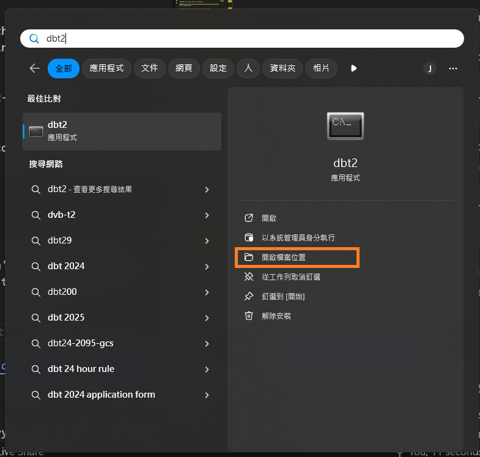
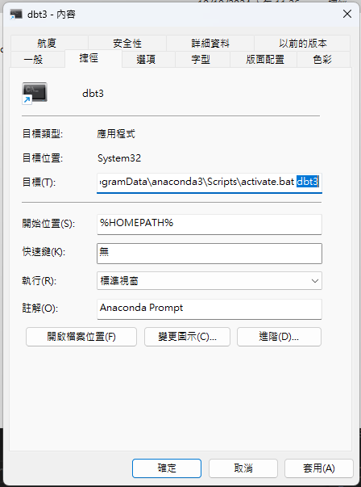

# `dbt-refactor-sql`
[](https://docs.getdbt.com/dbt-cli/cli-overview)
[](https://www.postgresql.org/)
[](https://www.python.org/)
[](https://www.docker.com/)

This is a `dbt-refactor-sql` quickstart template, that supports PostgreSQL run with podman. This turtorial assumed viewer has basic DBT and Jinja knowledge. If not, please have these lessons first.
  - [dbt-core-quickstart-template](https://github.com/saastoolset/dbt-core-quickstart-template)
  - [Jinja2-101-template](https://github.com/saastool/jinja2-101)
  
  This `dbt-refactor-sql` quickstart taken from the various [dbt Developer Hub](https://learn.getdbt.com/learn/course/refactoring-sql-for-modularity) and the infrastructure is based on [dbt-core-quickstart-template](https://github.com/saastoolset/dbt-core-quickstart-template), using `PostgreSQL` as the data warehouse. 

  If you have finished dbt-core-quickstart-template before, the infrastructure and architect we using here are total the same. Therefore, you can skip steps into [Step 3 Create a project​](#3-create-a-project)

- [`dbt-refactor-sql` Quickstart](#dbt-refactor-sql)
- [Steps](#steps)
  - [1 Introduction​](#1-introduction)
  - [2 Create a repository and env prepare​](#2-create-a-repository-and-env-prepare)
  - [3 Create a project​](#3-create-a-project)
  - [4 Prepare PostgreSQL​​](#4-prepare-postgresql)
  - [5 Migrate Code into DBT​](#5-migrate-code-into-dbt)
  - [6 Implement Sources by Translating Hard Coded Table References​ and Choosing Refactoring Strategies](#6-implement-sources-by-translating-hard-coded-table-references-and-choosing-refactoring-strategies)
  - [7 Cosmetic Cleanups and CTE Groupings​](#7-cosmetic-cleanups-and-cte-groupings)
  - [8 Centralizing Logic](#8-centralizing-logic)
  - [9 Splitting Up Models​](#9-splitting-up-models)
  - [10 Auditing](#9-auditing)

# Steps

## [1 Introduction​](https://docs.getdbt.com/guides/manual-install?step=1)

This template will develop and run dbt commands using the dbt Cloud CLI — a dbt Cloud powered command line with PostgreSQL.

- Prerequisites
  - Python/conda
  - Podman desktop
  - DBeaver
  - git client
  - visual code
  
  - ***Windows***: Path review for conda if VSCode have python runtime issue. Following path needs add and move to higher priority.

  ```
  C:\ProgramData\anaconda3\Scripts
  C:\ProgramData\anaconda3
  ```
  
- Create a GitHub account if you don't already have one.


## [2 Create a repository and env prepare​](https://docs.getdbt.com/guides/manual-install?step=2)

1. Create a new GitHub repository

- Find our Github template repository [dbt-refactor-sql](https://github.com/Yi-YaoWang/dbt-refactor-sql)
- Click the big green 'Use this template' button and 'Create a new repository'.
- Create a new GitHub repository named **dbt-refactor-sql-ex1**.


2. Select Public so the repository can be shared with others. You can always make it private later.
2. Leave the default values for all other settings.
3. Click Create repository.
4. Save the commands from "…or create a new repository on the command line" to use later in Commit your changes.
5. Install and setup envrionment

- Create python virtual env for dbt
  - For venv and and docker, using the [installation instructions](https://docs.getdbt.com/docs/core/installation-overview) for your operating system.
  - For conda in **Mac**, open terminal as usual

    ```command
    (base) ~ % conda create -n jinja 
    (base) ~ % conda activate jinja
    ```
    
  - For conda in **Windows**, open conda prompt terminal in ***system administrador priviledge***

    ```command
    (base) C:> conda create -n dbt dbt-core dbt-postgres
    (base) C:> conda activate dbt
    ```
    
  - ***Windows***: create shortcut to taskbar
    - Find application shortcut location

    

    - Copy and rename shortcut to venv name
    - Change location parameter to venv name
    
    

    - Pin the shortcut to Start Menu


- Start up db and pgadmin
  . use admin/Password as connection
  
  - ***Windows***:
    
    ```
    (dbt) C:> cd C:\Proj\myProject\50-GIT\dbt-core-qs-ex1
    (dbt) C:> bin\db-start-pg.bat
    ```
    
  - ***Mac***:
    
    ```
    (dbt) ~ % cd ~/Projects/dbt-macros-packages/
    (dbt) ~ % source ./bin/db-start-pg.sh
    (dbt) ~ % source ./bin/db-pgadm.sh
    ``` 

## [3 Create a project​](https://docs.getdbt.com/guides/manual-install?step=3)

Make sure you have dbt Core installed and check the version using the dbt --version command:

```
dbt --version
```

- Init project in repository home directory
  Initiate the jaffle_shop project using the init command:

```python
dbt init dbt_refactor
```

DBT will configure connection while initiating project, just follow the information below. After initialization, the configuration can be found in `profiles.yml`.

```YAML
dbt_refactor:
  outputs:
    dev:
      dbname: postgres
      host: localhost
      user: admin      
      pass: Passw0rd 
      port: 5432
      schema: dbt_refactor
      threads: 1
      type: postgres
  target: dev
```


Navigate into your project's directory:

```command
cd dbt_refactor
```

Use pwd to confirm that you are in the right spot:

```command
 pwd
```

Use a code editor VSCode to open the project directory

```command
(dbt) ~\Projects\dbt_refactor> code .
```
Let's remove models/example/ directory, we won't use any of it in this turtorial

## [4 Prepare PostgreSQL​](https://docs.getdbt.com/guides/manual-install?step=4)

- Test connection config

```
dbt debug
``` 

- Load sample data
 We should copy this data from the `db/seeds` directory.
  - Config seed schema
  Copy following codes and pasted at the bottom of ``/dbt_project.yml``
  ```yaml
  seeds:
    dbt_refactor:
      jaffle_shop:
        +schema: jaffle_shop
      stripe:
        +schema: stripe
  ```
  
  - copy seeds data
  **Windows**
  ```
  copy ..\db\* seeds
  ```

  **Mac**
  ```
  cp ../db/* seeds
  ```
  
  - Then create two folders, `jaffle_shop` and `stripe`
  - Put `customers.csv` and `orders.csv` into `jaffle_shop`
  - Put `payments.csv` into `stripe`
  - Run `dbt run`

- Verfiy result in database client
This command will create and insert the `customers.csv` files to the `dbt_refactor_jaffle_shop.customers` table, `orders.csv` to the `dbt_refactor_jaffle_shop.orders`, `payments.csv` file to the `dbt_refactor_stripe.payments`

## [5 Migrate Code into DBT​](https://learn.getdbt.com/learn/course/refactoring-sql-for-modularity/part-2-practice-refactoring-90min/practice-refactoring?page=2)

- Open your project in your favorite code editor.
- Remove example directory, models/`example/*`
- Create a subfolder called `legacy`.
- Within the legacy folder, create a file called models/legacy/`customer_orders.sql`.
- Paste the following SQL into the models/legacy/`customer_orders.sql` file, this is the "Legacy SQL" we are trying to refactor.

```SQL
WITH paid_orders as (select Orders.ID as order_id,
    Orders.USER_ID	as customer_id,
    Orders.ORDER_DATE AS order_placed_at,
        Orders.STATUS AS order_status,
    p.total_amount_paid,
    p.payment_finalized_date,
    C.FIRST_NAME    as customer_first_name,
        C.LAST_NAME as customer_last_name
FROM postgres.dbt_refactor_jaffle_shop.orders as Orders
left join (select ORDERID as order_id, max(CREATED) as payment_finalized_date, sum(AMOUNT) / 100.0 as total_amount_paid
        from postgres.dbt_refactor_stripe.payments
        where STATUS <> 'fail'
        group by 1) p ON orders.ID = p.order_id
left join postgres.dbt_refactor_jaffle_shop.customers C on orders.USER_ID = C.ID ),

customer_orders 
as (select C.ID as customer_id
    , min(ORDER_DATE) as first_order_date
    , max(ORDER_DATE) as most_recent_order_date
    , count(ORDERS.ID) AS number_of_orders
from postgres.dbt_refactor_jaffle_shop.customers C 
left join postgres.dbt_refactor_jaffle_shop.orders as Orders
on orders.USER_ID = C.ID 
group by 1)

select
p.*,
ROW_NUMBER() OVER (ORDER BY p.order_id) as transaction_seq,
ROW_NUMBER() OVER (PARTITION BY customer_id ORDER BY p.order_id) as customer_sales_seq,
CASE WHEN c.first_order_date = p.order_placed_at
THEN 'new'
ELSE 'return' END as nvsr,
x.clv_bad as customer_lifetime_value,
c.first_order_date as fdos
FROM paid_orders p
left join customer_orders as c USING (customer_id)
LEFT OUTER JOIN 
(
        select
        p.order_id,
        sum(t2.total_amount_paid) as clv_bad
    from paid_orders p
    left join paid_orders t2 on p.customer_id = t2.customer_id and p.order_id >= t2.order_id
    group by 1
    order by p.order_id
) x on x.order_id = p.order_id
ORDER BY order_id

```

- From the command line, enter

```
dbt run -m customer_orders
```

- Make sure everything passed

- Create a subfolder called `marts`.
- Copy, paste SQL file and renamed models/legacy/`customer_orders.sql` into models/marts/`fct_customer_orders.sql`
- From the command line, enter

```
dbt run -m fct_customer_orders
```

## [6 Implement Sources by Translating Hard Coded Table References and Choosing Refactoring Strategies​](https://learn.getdbt.com/learn/course/refactoring-sql-for-modularity/part-2-practice-refactoring-90min/practice-refactoring?page=3)

Now we can look at this __legacy__ code. It has poor readability, confusing and hard to maintaince. The first thing we could do is keep all table and column name in consistency by making letters into lower case.
- You can change all the codes by yourself or just copy following codes and replace models/marts/`fct_customer_orders.sql`.
```SQL
with paid_orders as (select orders.id as order_id,
    orders.user_id	as customer_id,
    orders.order_date as order_placed_at,
    orders.status as order_status,
    p.total_amount_paid,
    p.payment_finalized_date,
    c.first_name    as customer_first_name,
    c.last_name as customer_last_name
from postgres.dbt_refactor_jaffle_shop.orders as orders
left join (select orderid as order_id, max(created) as payment_finalized_date, sum(amount) / 100.0 as total_amount_paid
        from postgres.dbt_refactor_stripe.payments
        where status <> 'fail'
        group by 1) p on orders.id = p.order_id
left join postgres.dbt_refactor_jaffle_shop.customers c on orders.user_id = c.id ),

customer_orders 
as (select c.id as customer_id
    , min(order_date) as first_order_date
    , max(order_date) as most_recent_order_date
    , count(orders.id) as number_of_orders
from postgres.dbt_refactor_jaffle_shop.customers c
left join postgres.dbt_refactor_jaffle_shop.orders as orders
on orders.user_id = c.id
group by 1)

select
p.*,
row_number() over (order by p.order_id) as transaction_seq,
row_number() over (partition by customer_id order by p.order_id) as customer_sales_seq,
case when c.first_order_date = p.order_placed_at
then 'new'
else 'return' end as nvsr,
x.clv_bad as customer_lifetime_value,
c.first_order_date as fdos
from paid_orders p
left join customer_orders as c using (customer_id)
left outer join 
(
        select
        p.order_id,
        sum(t2.total_amount_paid) as clv_bad
    from paid_orders p
    left join paid_orders t2 on p.customer_id = t2.customer_id and p.order_id >= t2.order_id
    group by 1
    order by p.order_id
) x on x.order_id = p.order_id
order by order_id
```
After simple code cleanse, now we want to implement sources in model for better management and defined model lineage.
- Create a subfolder under your `models` folder called `staging`
- Under your `models/staging` folder, create two subfolders `stripe` and `jaffle_shop` - one for each source schema that our original query pulls from.
- Create a file under `models/staging/jaffle_shop` called `sources.yml`.
- Create a file under `models/staging/stripe` called `sources.yml`.
- Declare configurations for the corresponding source in each file:
  ```yaml
  version: 2

  sources:
    - name: jaffle_shop
      database: postgres
      schema: dbt_refactor_jaffle_shop
      tables:
        - name: customers
        - name: orders
  ```
  ```yaml
  version: 2

  sources:
    - name: stripe
      database: postgres
      schema: dbt_refactor_stripe
      tables:
        - name: payments
  ```
- Now that your sources are configured, open your `fct_customer_orders.sql` file and replace any hardcoded references (i.e, `postgres.dbt_refactor_jaffle_shop.customers`) with a [source function](https://docs.getdbt.com/docs/build/sources#selecting-from-a-source), referencing the sources you have set up.
  ```SQL
  with 
    paid_orders as (
        select orders.id as order_id,
            orders.user_id as customer_id,
            orders.order_date as order_placed_at,
            orders.status as order_status,
            p.total_amount_paid,
            p.payment_finalized_date,
            c.first_name as customer_first_name,
            c.last_name as customer_last_name
        from {{ source('jaffle_shop', 'orders') }} as orders
        left join (
            select 
                orderid as order_id,
                max(created) as payment_finalized_date,
                sum(amount) / 100.0 as total_amount_paid
            from {{ source('stripe', 'payments') }} as payments
            where status <> 'fail'
            group by 1
        ) p on orders.id = p.order_id
        left join {{ source('jaffle_shop', 'customers') }} as c on orders.user_id = c.id ),

    customer_orders as (
        select 
            c.id as customer_id
            , min(order_date) as first_order_date
            , max(order_date) as most_recent_order_date
            , count(orders.id) as number_of_orders
        from {{ source('jaffle_shop', 'customers') }}  c 
        left join {{ source('jaffle_shop', 'orders') }}  as orders on orders.user_id = c.id 
        group by 1
    )         

    select
        p.*,
        row_number() over (order by p.order_id) as transaction_seq,
        row_number() over (partition by customer_id order by p.order_id) as customer_sales_seq,
        case when c.first_order_date = p.order_placed_at
        then 'new'
        else 'return' end as nvsr,
        x.clv_bad as customer_lifetime_value,
        c.first_order_date as fdos
    from paid_orders p
    left join customer_orders as c using (customer_id)
    left outer join 
    (
        select
            p.order_id,
            sum(t2.total_amount_paid) as clv_bad
        from paid_orders p
        left join paid_orders t2 on p.customer_id = t2.customer_id and p.order_id >= t2.order_id
        group by 1
        order by p.order_id
    ) x on x.order_id = p.order_id
    order by order_id
  ```
 - Conduct a `dbt run -m fct_customer_orders` to ensure that your sources are configured properly and your model rebuilds in the warehouse.
 - You can check the model linage by using dbt power's `Lineage` tab.

## [7 Cosmetic Cleanups and CTE Groupings​​](https://learn.getdbt.com/learn/course/refactoring-sql-for-modularity/part-2-practice-refactoring-90min/practice-refactoring?page=4)

This section is heavy on best practices, our strategy here is using CTEs to break down the codes and do cosmetic cleanups during the process. But refactoring other `Legacy` codes might have other strategy that is better suit the needs.

-  CTE restructuring
Refactor codes to follow this structure:

- Add a `with` statement to the top of your `fct_customer_orders` model
```SQL
with 
-- import CTEs
-- logical CTEs
-- final CTE
-- simple select statement
```

- Add import CTEs after the `with` statement for each source table that the query uses. Ensure that subsequent `from` statements after the import CTEs reference the named CTEs rather than the `{{ source() }}`. We will focus on additional restructuring in the next section.

```SQL
with 

-- Import CTEs

customers as (

  select * from {{ source('jaffle_shop', 'customers') }}

),

orders as (

  select * from {{ source('jaffle_shop', 'orders') }}

),

payments as (

  select * from {{ source('stripe', 'payments') }}

),

paid_orders as (
    select orders.id as order_id,
        orders.user_id as customer_id,
        orders.order_date as order_placed_at,
        orders.status as order_status,
        p.total_amount_paid,
        p.payment_finalized_date,
        c.first_name as customer_first_name,
        c.last_name as customer_last_name
    from orders
    left join (
        select 
            orderid as order_id,
            max(created) as payment_finalized_date,
            sum(amount) / 100.0 as total_amount_paid
        from payments
        where status <> 'fail'
        group by 1
    ) p on orders.id = p.order_id
    left join customers as c on orders.user_id = c.id ),

customer_orders as (
    select 
        c.id as customer_id
        , min(order_date) as first_order_date
        , max(order_date) as most_recent_order_date
        , count(orders.id) as number_of_orders
    from customers as c 
    left join orders on orders.user_id = c.id 
    group by 1
)

select
    p.*,
    row_number() over (order by p.order_id) as transaction_seq,
    row_number() over (partition by customer_id order by p.order_id) as customer_sales_seq,
    case when c.first_order_date = p.order_placed_at
    then 'new'
    else 'return' end as nvsr,
    x.clv_bad as customer_lifetime_value,
    c.first_order_date as fdos
from paid_orders p
left join customer_orders as c using (customer_id)
left outer join 
(
    select
        p.order_id,
        sum(t2.total_amount_paid) as clv_bad
    from paid_orders p
    left join paid_orders t2 on p.customer_id = t2.customer_id and p.order_id >= t2.order_id
    group by 1
    order by p.order_id
) x on x.order_id = p.order_id
order by order_id
```
### Pull out intermediates and simple subqueries
1. Move any simple subqueries into their own CTEs, and then reference those CTEs instead of the subquery.
2. Wrap the ultimate remaining `select` statement in a CTE and call this CTE `final`.
3. Add a simple select statement at the end: `select * from final`.
```SQL
with 

-- Import CTEs

customers as (

  select * from {{ source('jaffle_shop', 'customers') }}

),

orders as (

  select * from {{ source('jaffle_shop', 'orders') }}

),

payments as (

  select * from {{ source('stripe', 'payments') }}

),

-- Logical CTEs

completed_payments as (
    select 
        orderid as order_id,
        max(created) as payment_finalized_date,
        sum(amount) / 100.0 as total_amount_paid
    from payments
    where status <> 'fail'
    group by 1
),

paid_orders as (
    select orders.id as order_id,
        orders.user_id as customer_id,
        orders.order_date as order_placed_at,
        orders.status as order_status,
        p.total_amount_paid,
        p.payment_finalized_date,
        c.first_name as customer_first_name,
        c.last_name as customer_last_name
    from orders
    left join completed_payments as p on orders.id = p.order_id
    left join customers as c on orders.user_id = c.id ),

customer_orders as (
    select 
        c.id as customer_id
        , min(order_date) as first_order_date
        , max(order_date) as most_recent_order_date
        , count(orders.id) as number_of_orders
    from customers as c 
    left join orders on orders.user_id = c.id 
    group by 1
),

-- Final CTE

final as (
    select
        p.*,
        row_number() over (order by p.order_id) as transaction_seq,
        row_number() over (partition by customer_id order by p.order_id) as customer_sales_seq,
        case when c.first_order_date = p.order_placed_at
        then 'new'
        else 'return' end as nvsr,
        x.clv_bad as customer_lifetime_value,
        c.first_order_date as fdos
    from paid_orders p
    left join customer_orders as c using (customer_id)
    left join 
    (
        select
            p.order_id,
            sum(t2.total_amount_paid) as clv_bad
        from paid_orders p
        left join paid_orders t2 on p.customer_id = t2.customer_id and p.order_id >= t2.order_id
        group by 1
        order by p.order_id
    ) x on x.order_id = p.order_id
    order by order_id
)

-- Simple Select Statment

select * from final
```

## [8 Centralizing Logic](https://learn.getdbt.com/learn/course/refactoring-sql-for-modularity/part-2-practice-refactoring-90min/practice-refactoring?page=5)

Now we can start breaking down the logic of the codes and trying to make better readability.

### Remove join in favor of window functions + some cosmetic cleanup
1. This is specific to this query, but one of the subqueries and fields (`customer_lifetime_value`) would be better written as a window function to avoid an unnecessary extra self join.

2. Add comments for case-when or window functions to help out future you
```SQL
with 

-- Import CTEs

customers as (

  select * from {{ source('jaffle_shop', 'customers') }}

),

orders as (

  select * from {{ source('jaffle_shop', 'orders') }}

),

payments as (

  select * from {{ source('stripe', 'payments') }}

),

-- Logical CTEs

completed_payments as (
    select 
        orderid as order_id,
        max(created) as payment_finalized_date,
        sum(amount) / 100.0 as total_amount_paid
    from payments
    where status <> 'fail'
    group by 1
),

paid_orders as (
    select orders.id as order_id,
        orders.user_id as customer_id,
        orders.order_date as order_placed_at,
        orders.status as order_status,
        p.total_amount_paid,
        p.payment_finalized_date,
        c.first_name as customer_first_name,
        c.last_name as customer_last_name
    from orders
    left join completed_payments as p on orders.id = p.order_id
    left join customers as c on orders.user_id = c.id
),

customer_orders as (
    select 
        c.id as customer_id
        , min(order_date) as first_order_date
        , max(order_date) as most_recent_order_date
        , count(orders.id) as number_of_orders
    from customers as c 
    left join orders on orders.user_id = c.id 
    group by 1
),

-- Final CTE

final as (
    select
        p.*,

        -- sales transaction sequence
        row_number() over (order by p.order_id) as transaction_seq,

        -- customer sales sequence
        row_number() over (partition by customer_id order by p.order_id) as customer_sales_seq,
        
        -- new vs returning customer
        case when c.first_order_date = p.order_placed_at
        then 'new'
        else 'return' end as nvsr,
        
        -- customer lifetime value
        sum(total_amount_paid) over (
            partition by paid_orders.customer_id
            order by paid_orders.order_placed_at
            ) as customer_lifetime_value,

        -- first day of sale
        c.first_order_date as fdos
    from paid_orders p
    left join customer_orders as c using (customer_id)
    order by order_id
)

-- Simple Select Statment

select * from final
```

### Use fully qualified table names and references
-  Cleanup for readability improvement, mostly fully qualifying column names and removing single letter aliases or other potentially confusing bits. 
```SQL
with 

-- Import CTEs

customers as (

  select * from {{ source('jaffle_shop', 'customers') }}

),

orders as (

  select * from {{ source('jaffle_shop', 'orders') }}

),

payments as (

  select * from {{ source('stripe', 'payments') }}

),

-- Logical CTEs

completed_payments as (
    select 
        orderid as order_id,
        max(created) as payment_finalized_date,
        sum(amount) / 100.0 as total_amount_paid
    from payments
    where status <> 'fail'
    group by 1
),

paid_orders as (
    select 
        orders.id as order_id,
        orders.user_id as customer_id,
        orders.order_date as order_placed_at,
        orders.status as order_status,
        completed_payments.total_amount_paid,
        completed_payments.payment_finalized_date,
        customers.first_name as customer_first_name,
        customers.last_name as customer_last_name
    from orders
    left join completed_payments on orders.id = completed_payments.order_id
    left join customers on orders.user_id = customers.id
),

customer_orders as (
    select 
        customers.id as customer_id
        , min(orders.order_date) as first_order_date
        , max(orders.order_date) as most_recent_order_date
        , count(orders.id) as number_of_orders
    from customers
    left join orders on orders.user_id = customers.id 
    group by 1
),

-- Final CTE

final as (
    select
        paid_orders.order_id,
        paid_orders.customer_id,
        paid_orders.order_placed_at,
        paid_orders.order_status,
        paid_orders.total_amount_paid,
        paid_orders.payment_finalized_date,
        paid_orders.customer_first_name,
        paid_orders.customer_last_name,

        -- sales transaction sequence
        row_number() over (order by paid_orders.order_id) as transaction_seq,

        -- customer sales sequence
        row_number() over (partition by paid_orders.customer_id order by paid_orders.order_id) as customer_sales_seq,
        
        -- new vs returning customer
        case when customer_orders.first_order_date = paid_orders.order_placed_at
        then 'new'
        else 'return' end as nvsr,
        
        -- customer lifetime value
        sum(paid_orders.total_amount_paid) over (
            partition by paid_orders.customer_id
            order by paid_orders.order_placed_at
            ) as customer_lifetime_value,

        -- first day of sale
        customer_orders.first_order_date as fdos
    from paid_orders
    left join customer_orders on paid_orders.customer_id = customer_orders.customer_id
    order by order_id
)

-- Simple Select Statment

select * from final
```

### Simplify with window functions
1. This is specific to this query, but one of the final columns was using a CTE to aggregate: `min(orders.order_date) as first_order_date` which could be simplified with a `first_value` window function.

2. Remove the `customer_orders` CTE and join in the `final` CTE.

3. Change the transformation logic for the following two columns: `nvsr` & `fdos`
```SQL
with 

-- Import CTEs

customers as (

  select * from {{ source('jaffle_shop', 'customers') }}

),

orders as (

  select * from {{ source('jaffle_shop', 'orders') }}

),

payments as (

  select * from {{ source('stripe', 'payments') }}

),

-- Logical CTEs

completed_payments as (
    select 
        orderid as order_id,
        max(created) as payment_finalized_date,
        sum(amount) / 100.0 as total_amount_paid
    from payments
    where status <> 'fail'
    group by 1
),

paid_orders as (
    select 
        orders.id as order_id,
        orders.user_id as customer_id,
        orders.order_date as order_placed_at,
        orders.status as order_status,
        completed_payments.total_amount_paid,
        completed_payments.payment_finalized_date,
        customers.first_name as customer_first_name,
        customers.last_name as customer_last_name
    from orders
    left join completed_payments on orders.id = completed_payments.order_id
    left join customers on orders.user_id = customers.id
),

-- Final CTE

final as (
    select
        paid_orders.order_id,
        paid_orders.customer_id,
        paid_orders.order_placed_at,
        paid_orders.order_status,
        paid_orders.total_amount_paid,
        paid_orders.payment_finalized_date,
        paid_orders.customer_first_name,
        paid_orders.customer_last_name,

        -- sales transaction sequence
        row_number() over (order by paid_orders.order_id) as transaction_seq,

        -- customer sales sequence
        row_number() over (partition by paid_orders.customer_id order by paid_orders.order_id) as customer_sales_seq,
        
        -- new vs returning customer
        case 
            when (
            rank() over (
                partition by customer_id
                order by order_placed_at, order_id
                ) = 1
            ) then 'new'
        else 'return' end as nvsr,

        -- customer lifetime value
        sum(paid_orders.total_amount_paid) over (
            partition by paid_orders.customer_id
            order by paid_orders.order_placed_at
            ) as customer_lifetime_value,

        -- first day of sale
        first_value(paid_orders.order_placed_at) over (
            partition by paid_orders.customer_id
            order by paid_orders.order_placed_at
            ) as fdos
    from paid_orders
)

-- Simple Select Statment

select * from final
order by order_id
```

- Execute dbt run.

## [9 Splitting Up Models](https://learn.getdbt.com/learn/course/refactoring-sql-for-modularity/part-2-practice-refactoring-90min/practice-refactoring?page=5)

After finished up code cleanse and logic refactor, we can now make use of dbt's model modularity by splitting up models.

### Create staging models
Your import files at the top of `fct_customer_orders.sql` are pulling directly from the source raw data, but we want that to happen it its own model, so future marts can reference those source files as well. 
We would like to create `staging` models to handle this import of the source and renaming potentially problematic fields in one place, so all future models can benefit from this.

1. Create files models/staging/jaffle_shop/`stg_jaffle_shop__customers.sql` & models/staging/jaffle_shop/`stg_jaffle_shop__orders.sql`.

2. Create a file models/staging/stripe/`stg_stripe__payments`.

3. Paste the following into each file, not only we have simply split the models. We do some data processing in the meanwhile.

**models/staging/jaffle_shop/stg_jaffle_shop__customers.sql**
```SQL
with 

source as (

  select * from {{ source('jaffle_shop', 'customers') }}

),

transformed as (

  select 

    id as customer_id,
    last_name as customer_last_name,
    first_name as customer_first_name,
    first_name || ' ' || last_name as full_name

  from source

)

select * from transformed
```

**models/staging/jaffle_shop/stg_jaffle_shop__orders.sql**
```SQL
with 

source as (

    select * from {{ source('jaffle_shop', 'orders') }}

),

transformed as (

  select

    id as order_id,
    user_id as customer_id,
    order_date as order_placed_at,
    status as order_status,

    case 
        when status not in ('returned','return_pending') 
        then order_date 
    end as valid_order_date

  from source

)

select * from transformed
```

**models/staging/stripe/stg_stripe__payments.sql**
```SQL
with 

source as (

    select * from {{ source('stripe', 'payments') }}

),

transformed as (

  select

    id as payment_id,
    orderid as order_id,
    created as payment_created_at,
    status as payment_status,
    round(amount / 100.0, 2) as payment_amount

  from source

)

select * from transformed
```

### Update references to point to staging models
Now that you have moved some simple transformation logic back to the staging models, it's time to persist that transformation into `fct_customer_orders.sql` by:

1. Referencing the new staging models using the `{{ ref('<your_model>') }}` function

2. Changing any column reference from the original column names to the new column names (i.e. `id` instead of `customer_id`)

You can change it by yourself or just paste it from the following codes:
```SQL
with

-- Import CTEs

customers as (

  select * from {{ ref('stg_jaffle_shop__customers') }}

),

orders as (

  select * from {{ ref('stg_jaffle_shop__orders') }}

),

payments as (

  select * from {{ ref('stg_stripe__payments') }}

),

-- Logical CTEs

completed_payments as (

  select 
    order_id,
    max(payment_created_at) as payment_finalized_date,
    sum(payment_amount) as total_amount_paid
  from payments
  where payment_status <> 'fail'
  group by 1

),

paid_orders as (

  select 
    orders.order_id,
    orders.customer_id,
    orders.order_placed_at,
    orders.order_status,

    completed_payments.total_amount_paid,
    completed_payments.payment_finalized_date,

    customers.customer_first_name,
    customers.customer_last_name
  from orders
  left join completed_payments on orders.order_id = completed_payments.order_id
  left join customers on orders.customer_id = customers.customer_id

),

-- Final CTE

final as (

  select
    order_id,
    customer_id,
    order_placed_at,
    order_status,
    total_amount_paid,
    payment_finalized_date,
    customer_first_name,
    customer_last_name,

    -- sales transaction sequence
    row_number() over (order by order_id) as transaction_seq,

    -- customer sales sequence
    row_number() over (partition by customer_id order by order_id) as customer_sales_seq,

    -- new vs returning customer
    case  
      when (
      rank() over (
      partition by customer_id
      order by order_placed_at, order_id
      ) = 1
    ) then 'new'
    else 'return' end as nvsr,

    -- customer lifetime value
    sum(total_amount_paid) over (
      partition by customer_id
      order by order_placed_at
      ) as customer_lifetime_value,

    -- first day of sale
    first_value(order_placed_at) over (
      partition by customer_id
      order by order_placed_at
      ) as fdos

    from paid_orders
		
)

-- Simple Select Statement

select * from final
order by order_id
```

### Move reusable component to intermediate model
Not only we can split our source models, some of the logic in your `fct_customer_orders.sql` we might want to reuse in later marts, such as `paid_orders` and `completed_payments`, so let's create an intermediate model with that logic which we can then reference in our fact model.

1. Under marts folder, add a new folder and file: `marts/intermediate/int_orders.sql`

You can split by yourself or just paste it from the following codes:
```SQL
with 

orders as (

  select * from {{ ref('stg_jaffle_shop__orders') }}

),

payments as (

  select * from {{ ref('stg_stripe__payments') }}

),

completed_payments as (

  select 
    order_id,
    max(payment_created_at) as payment_finalized_date,
    sum(payment_amount) as total_amount_paid
  from payments
  where payment_status <> 'fail'
  group by 1

),

paid_orders as (

  select 
    orders.order_id,
    orders.customer_id,
    orders.order_placed_at,
    orders.order_status,
    completed_payments.total_amount_paid,
    completed_payments.payment_finalized_date
  from orders
 left join completed_payments on orders.order_id = completed_payments.order_id
)

select * from paid_orders
```
Remove that same logic from `fct_customer_orders.sql`:
```SQL
with 

customers as (

  select * from {{ ref('stg_jaffle_shop__customers') }}

),

paid_orders as (

  select * from {{ ref('int_orders') }}

),

final as (
    select
        paid_orders.order_id,
        paid_orders.customer_id,
        paid_orders.order_placed_at,
        paid_orders.order_status,
        paid_orders.total_amount_paid,
        paid_orders.payment_finalized_date,
        customers.customer_first_name,
        customers.customer_last_name,

        -- sales transaction sequence
        row_number() over (order by paid_orders.order_id) as transaction_seq,

        -- customer sales sequence
        row_number() over (partition by paid_orders.customer_id order by paid_orders.order_id) as customer_sales_seq,
        
        -- new vs returning customer
        case 
            when (
            rank() over (
                partition by paid_orders.customer_id
                order by paid_orders.order_placed_at, paid_orders.order_id
                ) = 1
            ) then 'new'
        else 'return' end as nvsr,

        -- customer lifetime value
        sum(paid_orders.total_amount_paid) over (
            partition by paid_orders.customer_id
            order by paid_orders.order_placed_at
            ) as customer_lifetime_value,

        -- first day of sale
        first_value(order_placed_at) over (
            partition by paid_orders.customer_id
            order by paid_orders.order_placed_at
            ) as fdos
    from paid_orders
    left join customers on paid_orders.customer_id = customers.customer_id
)

select * from final
```

And you're done! Conduct `dbt run` to build all the project.

## [10 Auditing](https://learn.getdbt.com/learn/course/refactoring-sql-for-modularity/part-2-practice-refactoring-90min/practice-refactoring?page=6)

- Let's ensure any changes make to the `fct_customer_orders.sql` file does not have unintended consequences causing a drift between the old and new versions.
  
- Import `audit_helper` to make it possible real quick!
- Create a file `packages.yml` in the root folder
``` yaml
packages:
  - package: dbt-labs/audit_helper
    version: 0.12.0
```
Run `dbt deps` in the command line

- Within the analysis folder, add a new file: `compare_queries.sql`
Paste the following into the `compare_queries.sql` file:
```SQL
 



{{ 
audit_helper.compare_relations(
        a_relation=old_etl_relation,
        b_relation=dbt_relation,
        primary_key="order_id"
) }}
```
Run `dbt compile` in the command line

Then, look for the compiled SQL file in `target/compiled/dbt_refactor/analyses/compare_queries.sql`.
Run this SQL using power-DBT's `Execute dbt's SQL` or any data visualization tool.

It should be showing 100% percent_of_total match between the two files, which means we have successfully refactor legacy SQL!
See more at [dbt_audit_helper](https://hub.getdbt.com/dbt-labs/audit_helper/latest/)
